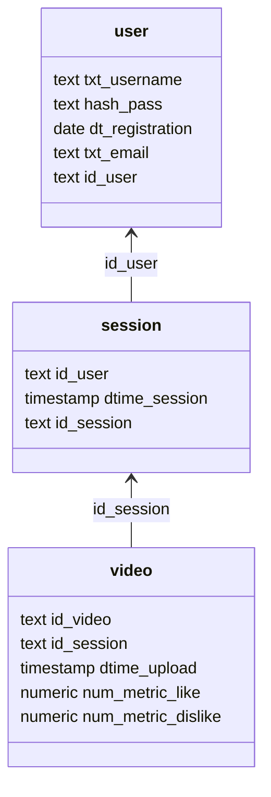

```mermaid

classDiagram
direction BT
class session {
   text id_user
   timestamp dtime_session
   text id_session
}
class user {
   text txt_username
   text hash_pass
   date dt_registration
   text txt_email
   text id_user
}
class video {
   text id_video
   text id_session
   timestamp dtime_upload
   numeric num_metric_like
   numeric num_metric_dislike
}

session  -->  user : id_user
video  -->  session : id_session

```